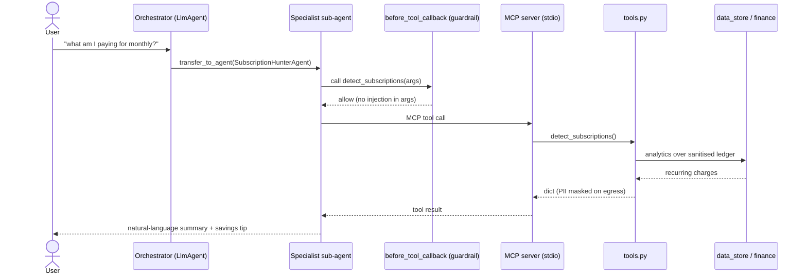

# Architecture

LedgerLens is deliberately layered so that each concern is isolated, pure where
possible, and independently testable. Dependencies point **downward** only.

```
┌───────────────────────────────────────────────────────────────────┐
│  Interface           cli.py  (console script + REPL)                │
├───────────────────────────────────────────────────────────────────┤
│  Agents        agents.py (ADK/Gemini)  │  orchestrator.py (offline) │
│                └─────────── ask(question) -> AgentResponse ─────────┘│
├───────────────────────────────────────────────────────────────────┤
│  Tool surface  mcp_server.py (MCP/stdio)  ──┐                        │
│                                             ├─► tools.py             │
│                agents.py FunctionTools ─────┘   (validate + mask)    │
├───────────────────────────────────────────────────────────────────┤
│  Security      security.py   (validate · mask · redact · injection) │
├───────────────────────────────────────────────────────────────────┤
│  Domain logic  finance.py    (pure analytics)                       │
│                data_store.py (CSV load + ingress sanitisation)      │
│                models.py     (Transaction / Subscription / Budget)  │
└───────────────────────────────────────────────────────────────────┘
```

## Request flow (live ADK path)



In the **offline path**, `orchestrator.py` replaces the LLM routing with
deterministic keyword classification but calls the *same* `tools.py`, so
behaviour and security are identical — only the natural-language phrasing
differs.

## Why these boundaries

- **`models.py` / `finance.py` are pure** — no I/O, no ADK, no MCP. This makes
  the money math exhaustively unit-testable with exact expected values.
- **Security is a single layer** applied at three choke points (ingress on
  load, the tool-call boundary, egress on results) rather than sprinkled
  through call sites, so it's auditable in one file.
- **`tools.py` is the one source of truth** for agent capabilities. Both the
  MCP server and the ADK FunctionTools are thin wrappers over it, so every
  surface inherits the same validation + masking. There is no "analyse" tool
  that can move money — the capability simply doesn't exist.
- **Two backends, one contract** (`ask() -> AgentResponse`) keeps the project
  key-optional and fully testable offline while still shipping a real
  Gemini-powered multi-agent system.

## The subscription-detection heuristic

`finance.detect_recurring_subscriptions` is intentionally simple and
explainable (see docstring): group by merchant → cluster charges near the
median amount → report clusters spanning ≥ N distinct months, priced at the
median. This correctly flags a $15.99 Netflix charge seen across 6 months while
ignoring a one-off $1,299 laptop purchase.
